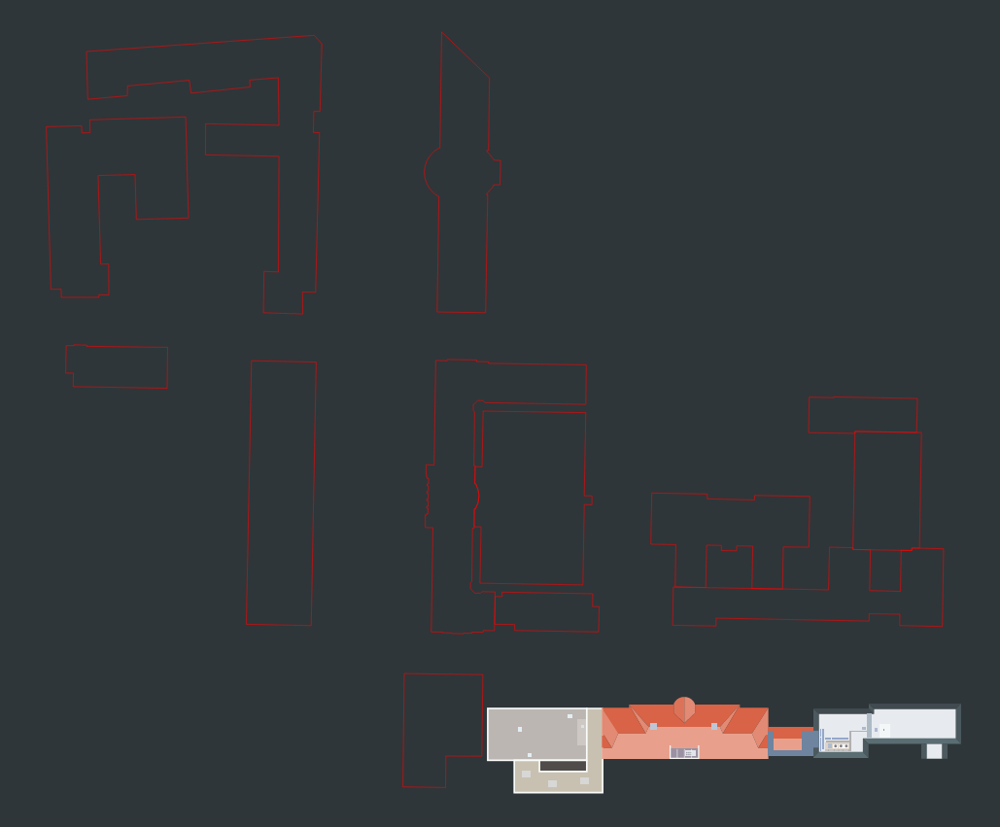

= Steckbrief link:http://htwkarte.de[HTWKarte]
:author: Projektmitglieder: Benedikt Beigang, INM-22
:data-uri:

[cols="1,1", grid="none", frame="none"]
|===
a|
.Sicht auf den Campus mit drei fertiggestellten Gebäuden

a| 
.Sicht auf das Innere eines Gebäudes

|===

== Problemstellung

Das Finden von Räumen kann besonders in den ersten Tagen des eigenen Studiums ein schwieriges Unterfangen sein. Aber auch später kann es vorkommen, dass durch neue Module und Veranstaltungen Räume gefunden werden müssen, die in weniger vertrauten Gebäuden liegen. Die **HTWKarte** möchte bei diesem alltäglichen Unterfangen helfen.

== Projektbeschreibung

Im Rahmen des Moduls Progressiv-Web-Apps soll eine Karten-App entwickelt werden, der den Campus (oder Campusse) der HTWK Leipzig abbildet. Die App soll es ermöglichen, Räume über eine Suchleiste oder per Direkt-Link zu finden und sich zu diesen navigieren zu lassen. Je nach Verfügbarkeit von Raumdaten sollen diese Daten zu jedem Raum angezeigt werden. Dazu gehört auch eine Anzeige, welche Räume gerade frei sind und welche belegt sind. Die App soll dabei auch offline als PWA nutzbar sein, um auch bei fehlender Internetverbindung seinen nächsten Raum zu finden.

== Technologische Umsetzung

.Frameworks
****
* **React/TS:** Die App soll in React mit TypeScript entwickelt werden. React bietet sich hier besonders an, da es eine gute Strukturierung von Komponenten ermöglicht und durch die Verwendung von TypeScript eine bessere Codequalität erreicht werden kann. Außerdem ist durch die Verbreitung von React auf eine große Community zurückzugreifen.
* **Vite:** soll als Build-Tool verwendet werden, da es schnelle Build-Zeiten ermöglicht und durch die Verwendung von _ES-Modulen_ eine bessere Performance erreicht werden kann.
* **Material-UI:** soll als UI-Framework verwendet werden, um eine schnelle und moderne UI zu erstellen. Material-UI bietet viele vorgefertigte Komponenten, ermöglicht aber auch das Erstellen von Themes für eine individuelle Anpassung.
* **D3.js:** soll für die Visualisierung der Karte verwendet werden. Da die Karte aus mehreren Campussen, mit vielen Gebäuden und Räumen aufgebaut ist, wird ein featurerreiches performantes Framework benötigt. D3.js bietet die Möglichkeit SVG-Elemente zu laden, zu erstellen, zielgerichtet anzusteuern, um diese zu animieren und zu manipulieren.
* **React-Router:** soll ermöglichen von anderen Apps auf bestimmte Räume zu verlinken.
****

.State-Management
****
* **Laufzeit-State:** Für den State zur Laufzeit wird mit den in React neu eingeführten Reducern gearbeitet. Diese wurden von Redux übernommen, haben jedoch den Vorteil, nicht abhängig von externen Libraries zu sein. Nötige States sind unter andrem:
** Aktueller Campus
** Aktuelles Gebäude
** Aktuelle Etage
** Aktueller Raum
** Zoom-Position
** Zoom-Stufe
* **Persistenter-State:** Um die Daten auch nach Abbruch einer Internetverbindung noch Verfügbar zu haben, soll _tanstack query_ genutzt werden. Außerdem bietet die Library einfaches, automatisch gecachte Abfragen von Ressourcen. Nötige State sind unter anderem:
** Metadaten über Campusse
** Metadaten über Gebäude
** Metadaten über Räume
** SVGs aller Etagen
****

.Offline-Fähigkeit
****
Die Hauptfeatures der Karte greifen ausschließlich auf gut cache-bare Dateien zu. Primär wären hier zu nennen die SVGs aller Etagen der Gebäude, sowie die Metainformationen über Campusse, Gebäude und Räume. Das Anzeigen der Verfügbarkeit eines Raumes, ist dabei etwas komplizierter, da diese Daten sich schneller ändern können. Die Raumbelegung aller Räume könnte daher bei jedem Start der App, mit Internetverbindung, neu abgefragt werden, sodass dynamisch zur Laufzeit entschieden werden kann, ob ein Raum frei ist oder nicht. So wäre keine permanente Internetverbindung notwendig.

* **Service Worker:** Der Service Worker wird verwendet, um die App offline-fähig zu machen. Er wird dazu genutzt, um die App-Shell zu cachen und die App im Offline-Modus zu starten.
* **Cache API:** Die Cache API wird verwendet, um Daten im Cache zu speichern. So können insbesondere die SVG-Daten der Etagen aller Gebäude, sowie die Daten über die Campusse, Gebäude und Räume auch offline abgerufen werden.
****

== Erwartete Hindernisse und andere Informationen

* Obwohl D3.js ein potentes Framework für die Visualisierung von SVG-Elementen ist, kann bei zu umfangreichen Objekten die Performance leiden. Deshalb soll von Anfang an darauf geachtet werden, dass nur die nötigsten Daten geladen und angezeigt werden. Dadurch soll eine positive Nutzererfahrung bestmöglich gewährleistet werden.
* Zwar gibt es verfügbare Daten zu den Räumen der HTWK, jedoch sind diese teilweise veraltet und müssen unter Umständen manuell aktualisiert werden. Je nach Umfang und Entwicklungsstand muss über die Umsetzbarkeit der Anzeige aller Raumdaten bis zur Abgabe entschieden werden.
* Da keine Grundrisse der Gebäude der HTWK für Außenstehende verfügbar sind, muss auf die Brandschutzpläne in den Gebäuden zurückgegriffen werden. Die Aufbereitung zu verwendbaren SVG-Dateien in der App ist je nach Gebäude unterschiedlich aufwendig, erfordert in jedem Fall aber deutlich Zeit für den gesamten Campus. Deshalb wird zunächst nur exemplarisch ein paar Gebäude umgesetzt, um alle Funktionalitäten der App zu demonstrieren.
* Die App soll durch den HTWKalender verwendet werden, sodass angezeigt Räume in Terminen per Link direkt auf die Karte verweisen. Dafür sind Absprachen bezüglich des URL-Schemas notwendig.
* Die App wird auf den link:https://gitlab.dit.htwk-leipzig.de/htwk-software/htwkarte[GitLab-Server] der HTWK entwickelt.
* Der aktuelle Stand der App kann sich link:https://htwkarte.pages.dev/[hier] angesehen werden.

== Zusammenfassung der geplanten Features

* Karte des Campus der HTWK Leipzig (wenn möglich alle Campusse)
* Suchfunktion für Räume
* Anzeige von Raumdaten (inklusive Belegung)
* Navigation zu Räumen über URL
* Offline-Fähigkeit

== Quellen und Referenzen

* link:https://react.dev/[React]
* link:https://reactrouter.com/en/main[React Router]
* link:https://react.dev/learn/scaling-up-with-reducer-and-context[Reducer (Build-In)]
* link:https://vitejs.dev/guide/[Vite]
* link:https://vite-pwa-org.netlify.app/guide/[Vite PWA Plugin]
* link:https://developer.mozilla.org/en-US/docs/Web/API/Service_Worker_API[Service Worker API]
* link:https://d3js.org/[D3.js]
* link:https://tanstack.com/query/latest[TanStack Query]
* link:https://mensa.heylinus.de/[Inspiration: HTWK Mensa Mate]