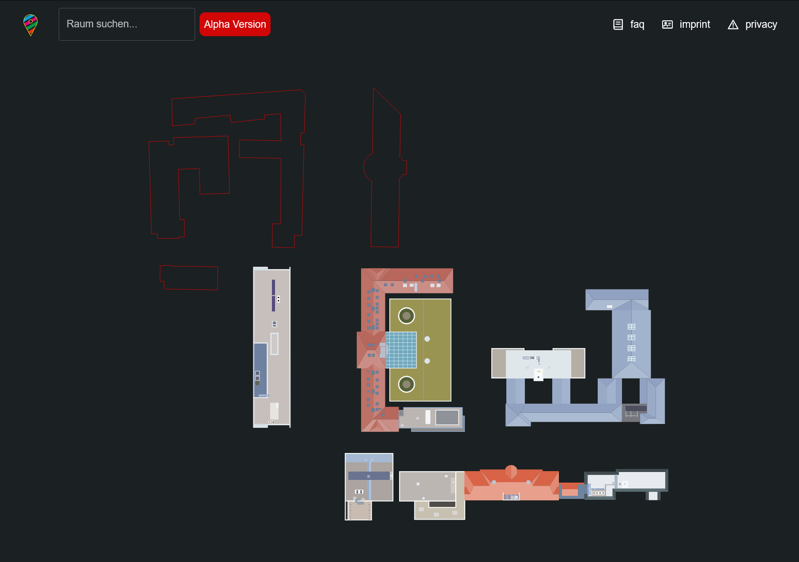

= HTWKarte Dokumentation
:author: Benedikt Beigang 81853
:data-uri:
:hide-uri-scheme:
:toc: left

.https://map.htwk-leipzig.de/
****
---
Die HTWKarte hat sich zum Ziel gesetzt die Orientierung auf dem Campus der HTWK Leipzig zu erleichtern. Sie ermöglicht es, Räume und Personen schnell zu finden.
****

.Sicht auf die Startseite die den Campus zeigt

== Features

[cols="^2a,a", frame="none"]
|===
| image::img/BuildingCard.png[] 
| **Gebäude Info** +
Jedes Gebäude ist in der Außenansicht klickbar und zeigt Informationen über das Gebäude an.

| image::img/TR_A.png[] 
| **Innenansicht von Gebäuden** +
Da die HTWK unzählige Räume in den unterschiedlichsten Gebäuden hilft die Innenansicht zunächst einmal sich zu orientieren. Mit Hilfe des sich unten rechts befindenden Toggle-Buttons kann die Etage gewechselt werden.

| image::img/Event.png[]
| **Raumbelegung** +
Die Raumbelegung eines Tages wird für jeden Raum angezeigt (vorausgesetzt es gibt eine). Sollte aktuell eine Belegung stattfinden, wird das entsprechende Ereignis gelb hervorgehoben.

| image::img/BuroCard.png[]
| **Büro Info** +
Ist ein Raum ein Büro, so wird für diesen Raum angezeigt, wer sich in diesem Büro befindet und wie man diese Person erreichen kann.

| image::img/Search.png[]
| **Raumsuche** +
In der Suche kann entweder direkt nach Räumen gesucht werden oder nach Personen, welche ein Büro besitzen. Ist der gesuchte Raum existent wird zu diesem navigiert.

| image::img/urlSearch.png[]
| **Raumsuche über die URL** +
Es ist auch möglich den Raum in der URL anzugeben und so nach dem Raum zu suchen. Dies ist zum Beispiel hilfreich für den link:https://cal.htwk-leipzig.de/[HTWKalender] um direkt nach dem Ort seiner nächsten Vorlesung zu suchen.

|===

== Technologien

Als grundlegendes Framework habe ich mich für link:https://react.dev/[React] und link:https://www.typescriptlang.org/[Typescript] entschieden, zusammen mit dem npm-Paket link:https://vitejs.dev/[vite]. link:https://mui.com/material-ui/[Material-UI] ist das UI-Framework, welches das grafische Fundament der HTWKarte bildet. Für die Visualisierung der Karte wird link:https://d3js.org/[D3.js] verwendet. Für eine vereinfachte Integration einer PWA Funktionalität habe ich auf das vite-plugin link:https://vite-pwa-org.netlify.app/[vite-pwa] zurückgegriffen, mit dem sehr einfach eine PWA erstellt werden kann. Zudem nutze ich link:https://tanstack.com/query/latest[TanStack (react) query] für ein leichteres Handling und Caching von API-Requests.

== Caching und Offline-Funktionalität

Die HTWKarte nutzt Hauptsächlich zwei zentrale APIs, bei denen die Frage der Aktualität eine Rolle spielt: 

* **link:https://app.htwk-leipzig.de/api/telephone[https://app.htwk-leipzig.de/api/telephone]** +
Liefert zu jeder bekannten Person die Kontaktdaten und in welchem Raum man die Person findet.
* **link:https://cal.htwk-leipzig.de/api/schedule[https://cal.htwk-leipzig.de/api/schedule]** +
Liefert für einen gegeben Zeitraum die Belegung jedes Raums der HTWK Leipzig.

Durch TanStack Query werden alle relevanten API-Abfragen automatisch gecached, bei normaler Nutzung im Browser. Wenn jedoch die Applikation im PWA Modus ist, also heruntergeladen und installiert wurde, gelten die Workbox-Einstellungen, welche in der vite.config.ts definiert sind. Durch das vite-pwa Plugin wird der Service-Worker automatisch erstellt und konfiguriert, sodass kaum Entwicklungsaufwand verloren geht. Das Fetchen und Updaten der Ressourcen geschieht automatisch bei vorhandener Internet-Verbindung. Dadurch dass die Daten sich nicht ständig ändern (höchstens gelegentlich), wurden die Gültigkeit der Daten auf eine Woche eingestellt. Wenn also tatsächlich die Verbindung abbricht kann sich noch eine Woche in der Zukunft der Belegungsplan eines Raumes angeschaut werden. Für alle weiteren Ressourcen, sind keine komplexen Caching-Strategien notwendig, da sie sich nicht ändern. Dazu zählen unter anderem die SVG-Dateien der Gebäude-Etagen, die sich nicht ändern und somit nur einmalig geladen werden müssen.

== Kartenvisualisierung

Damit die Etagen der Gebäude angezeigt, sowie mit ihnen interagiert werden kann, musste für jede einzelne Etage eine SVG erstellt werden. Dies schließt nicht nur die eigentlich Erstellung der Etagenübersicht mit ein, sondern auch die Referenzierung der SVG-Objekte innerhalb der SVG, sodass auf diese dynamisch zugegriffen werden kann. Der aller größte Teil dabei sind die `<rect>` und `<path>` der Räume, sodass diese angeklickt und mit den korrekten Daten angezeigt werden. 

Ursprünglich sollten die Raumnummern dynamisch über die ID in der SVG als `<text>` generiert werden. Dies wurde jedoch verworfen, da dies die Anzahl der DOM-Elemente drastisch erhöht, und somit die Performance beeinträchtigt hätte. Stattdessen werden die Raumnummern während der SVG-Anfertigung in die SVG eingefügt und zum Schluss als ein großer Pfad in die SVG eingefügt.

Das Laden der entsprechenden Etagen erfolgt dynamisch. Es werden immer nur die SVG-Dateien in den DOM-geladen und gerendert, die derzeit zu sehen sind. Das gleiche gilt auch für die Anfrage der Ressourcen an den Server. Jede SVG wird bei Bedarf erst angefragt, was jedoch auf Grund der kleinen Größe (ein paar Kilobyte) keine größere Rolle spielt.

Als Grundlage für die Etagen wurden die öffentlichen Brandschutzpläne genutzt, welche als Vorlage in Inkscape dienten. Auch zu nennen ist der Rechercheaufwand, da die Korrektheit der Daten auf den Brandschutzplänen manchmal nicht gegeben ist und vorort in Person die Beschaffenheit der Räume/Raumaufteilung in Erfahrung erbracht werden musste.

== State-Management und Routing

Um Zustände Komponentenübergreifen auszutauschen wurde der kürzlich in react eingebaute reducer (useReducer) verwendet. Dieser ermöglicht es, den Zustand einer Komponente in einer anderen Komponente zu ändern, ohne dass diese Komponente den Zustand selbst hält. Das Feature ist ähnlich zu dem in Redux, benötigt aber durch die direkte Integration in React keine zusätzlichen Bibliotheken.

Den Zustand des aktuellen Suchbegriffes (normalerweise ein Raum) wird in der URL als Parameter übergeben. Somit ist es möglich auch von anderen Webseiten (zB dem HTWKalender) aus auf bestimmte Räume zu verweisen.

== Deployment

Eine GitLab-CI/CD Pipeline deployed automatisch eine neue Version der Karte, sobald der main-Branch einen neuen commit/merge erhält. Mit der freundlichen Unterstützung der HTWK und Elmar Kresse läuft die HTWKarte unter der offiziellen HTWK-Domain link:https://map.htwk-leipzig.de[map.htwk-leipzig.de].
