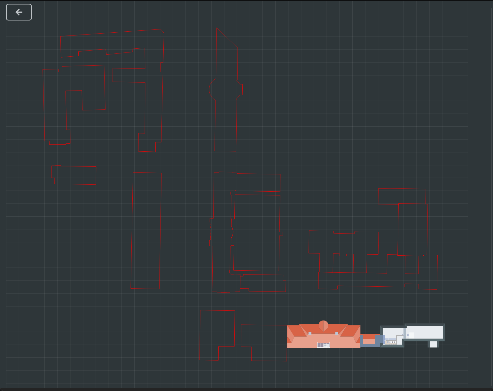
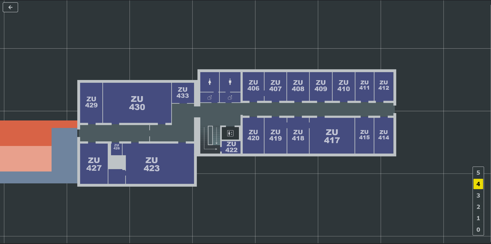

= HTWKarte

This project wants to make the locations of the HTWK Leipzig transparent. Find your next lecture-room, search for the room of your professor or get an overview of all the campuses that the HTWK has to offer.

.See the current state of development link:https://htwkarte.pages.dev/[here]
****
****

== How to run it locally

`npm install` - Installs all dependencies that are needed to run the project. +
`npm run dev` - Starts the app and can be viewed on link:http://localhost:3000[http://localhost:3000] in the browser.

== Tech-Stack

* Primary Tools
** Node.js
** React + TS + Vite
** D3.js
** Material-UI
** Leaflet (upcoming, for city-view)
* Secondary Tools
** Inkscape (for svg creation)

== Gallery

.The main campus at the Karl-Liebknecht-Straße

.A view inside the Zuse-Bau with all the rooms on floor 4 

