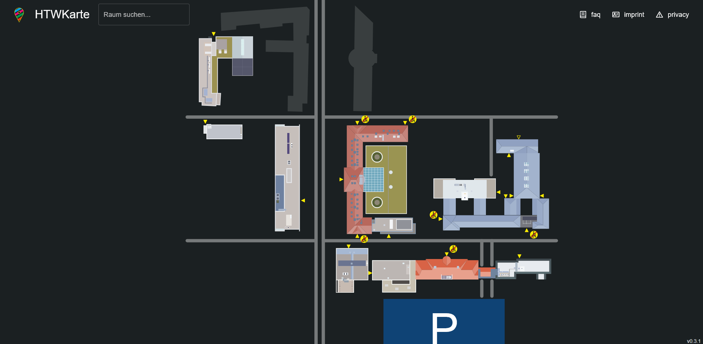
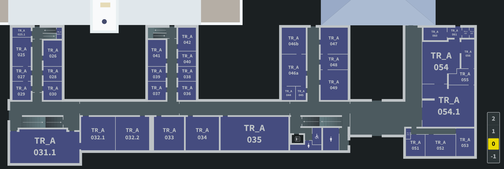
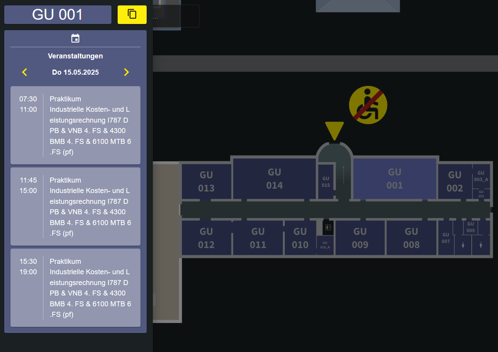
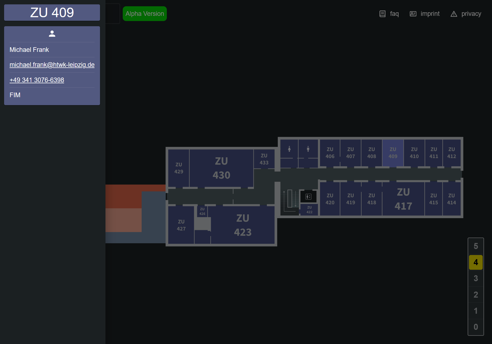

= HTWKarte

This project wants to make the locations of the HTWK Leipzig transparent. Find your next lecture-room or get an general overview of the HTWK.

.See the offical deployed app at: link:https://map.htwk-leipzig.de/[map.htwk-leipzig.de]
****
****

== How to run it locally

.Install all dependencies that are needed to run the project with:
[source,bash]
----
npm install
----

.Start the app and view it on link:http://localhost:3000[localhost:3000] in the browser with:
[source,bash]
----
npm run dev
----

.If you want to test the app in https mode on link:http://localhost:4433[localhost:4433], you can run:
[source,bash]
----
npm run build
npm run serve
----

== Tech-Stack

* Primary Tools
** link:https://nodejs.org/[Node.js]
** link:https://react.dev/[React + TS]
** link:https://vitejs.dev/[Vite]
** link:https://d3js.org/[D3.js]
** link:https://mui.com/material-ui/[Material-UI]
* Secondary Tools
** link:https://inkscape.org[Inkscape] (primarily for floor-SVGs)

== Gallery

.The main campus at the Karl-Liebknecht-Straße

---

.A view inside the one building 

---

.Events inside a room

--- 

.Information about the Professor in a room

