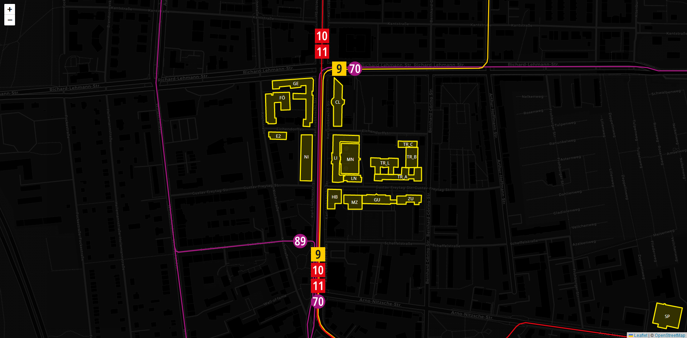

= HTWKarte

This project wants to make the locations of the HTWK Leipzig transparent. Find yourt next lecture-room, search for the room of your professor or get an overview of all the campuses that the HTWK has to offer.

== How to run it

`npm install` - Installs all dependencies that are needed to run the project. +
`npm start` - Starts the app and can be viewed on link:http://localhost:3000[http://localhost:3000] in the browser.

== Gallery

.The main campus at the Karl-Liebknecht-Straße

.An overview of Leipzig with all its campuses of the HTWK

